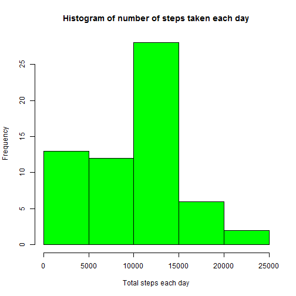
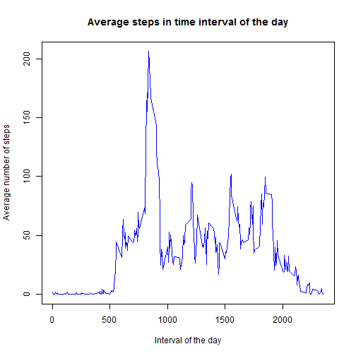
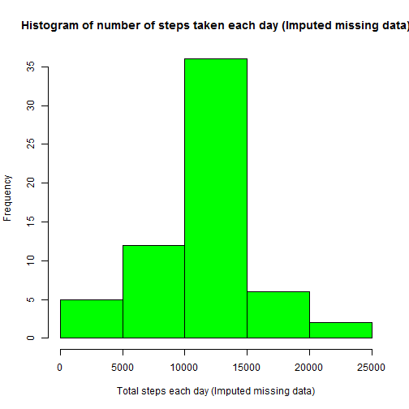
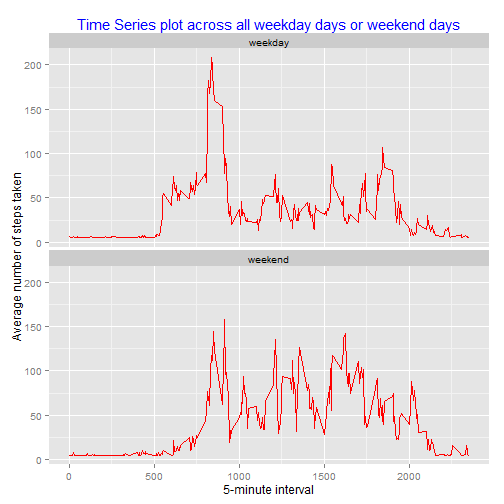

  

## Loading and preprocessing the data

**Load and pre-process the data**

```r
if (!file.exists("activity.csv")) 
  { 
    unzip("activity.zip") 
  }
activityData<- read.csv("activity.csv", header = TRUE)
activityData$date<-as.Date(activityData$date)
```


## What is mean total number of steps taken per day?

**Calculate the total number of steps taken per day**

```r
totalStepsEachDay <- tapply(activityData$steps, activityData$date
                            , sum, na.rm = TRUE)
```

**Plot the Histogram of total number of steps taken each day**

```r
hist(totalStepsEachDay, xlab = "Total steps each day"
     , main ="Histogram of number of steps taken each day"
     , col = "Green")
```

 

**Calculate and report the mean and median of the total number of steps taken per day**

```r
mean_totalStepsEachDay <- mean(totalStepsEachDay)
median_totalStepsEachDay <- median(totalStepsEachDay)
```
The mean value for total number of steps taken per day is: **9354.2295082**.  
The median value for total number of steps taken per day is: **10395**.

## What is the average daily activity pattern?

**Make a time series plot of the 5-minute interval (x-axis) and the average number of steps taken, averaged across all days (y-axis)**

```r
avgStepsEachInterval <- tapply(activityData$steps, activityData$interval
                               , mean, na.rm = TRUE)
plot(names(avgStepsEachInterval), avgStepsEachInterval
     , xlab = "Interval of the day", ylab = "Average number of steps"
     , type = "l", col="blue", lwd =1
     , main = "Average steps in time interval of the day")
```

 

**Which 5-minute interval, on average across all the days in the dataset, contains the maximum number of steps?**

```r
maxStepsInterval <- names(which.max(avgStepsEachInterval))
```
The interval: **835** contains the maximum number of steps.


## Imputing missing values

**Calculate and report the total number of missing values in the dataset**

```r
missingData <-sum(is.na(activityData$steps))
```
Total number of missing value in the dataset is: **2304**.  

**Devise a strategy for filling in all of the missing values in the dataset and create a new dataset with missing data filled in**  
  
***Strategy to fill in missing data:*** Missing data were filled with the mean of number of steps for all the available values across all the days.

```r
activityData_Imputed<-activityData
activityData_Imputed$steps[is.na(activityData_Imputed$steps)] = mean(activityData_Imputed$steps, na.rm=TRUE)
```

**Make a histogram of the total number of steps taken each day**

```r
totalStepsEachDay_Imputed <- tapply(activityData_Imputed$steps
                                    , activityData_Imputed$date, sum, na.rm = TRUE)
hist(totalStepsEachDay_Imputed, xlab = "Total steps each day (Imputed missing data)"
     , main ="Histogram of number of steps taken each day (Imputed missing data)"
     , col = "Green")
```

 

**Calculate and report the mean and median of the total number of steps taken per day**

```r
mean_totalStepsEachDay_Imputed <- format((mean(totalStepsEachDay_Imputed)), sci=FALSE)
median_totalStepsEachDay_Imputed <- format((median(totalStepsEachDay_Imputed)), sci=FALSE)
```

The mean value (with imputed data) for total number of steps taken per day is: **10766.19**.  
The median value (with imputed data) for total number of steps taken per day is: **10766.19**. 

There are impacts on mean as well as median data while imputing the missing data, both have been increased but in imputed dataset mean and median are same *(With the strategy used in this case to fill the missing data)*.

***NOTE: Missing data were filled with the mean of number of steps for all the available values across all the days.***

## Are there differences in activity patterns between weekdays and weekends?
**Create a new factor variable in the dataset with two levels - "weekday" and "weekend" indicating whether a given date is a weekday or weekend day.**

```r
activityData_Imputed$day<-weekdays(activityData_Imputed$date)
activityData_Imputed$daytype <- "weekday"
activityData_Imputed$daytype[activityData_Imputed$day %in% c("Saturday", "Sunday")]<-"weekend"
```

**Make a panel plot containing a time series plot of the 5-minute interval (x-axis) and the average number of steps taken, averaged across all weekday days or weekend days (y-axis)**

```r
library(ggplot2)
aggregatedData_ByIntervalDaytype <- aggregate(steps ~ interval + daytype
                                              , data=activityData_Imputed, mean)
ggplot(aggregatedData_ByIntervalDaytype, aes(x=interval, y=steps)) + 
  geom_line(color="red") + 
  facet_wrap(~ daytype, nrow=2, ncol=1) +
  xlab("5-minute interval") + 
  ylab("Average number of steps taken") +
  ggtitle("Time Series plot across all weekday days or weekend days") +
  theme(plot.title = element_text(colour = "blue", size = "15"))
```

 
